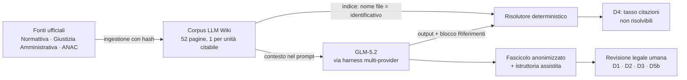

# Un agente legale verificabile per il diritto degli appalti italiano

## GLM-5.2 su corpus ancorato: zero citazioni inventate su una prova pre-registrata

**Synthos Logic Lab — Caso di studio n. 1** · v2 (bozza per pubblicazione) · 23 luglio 2026
Owner: Pablo Liuzzi · Repository: [Synthos-Logic/legal-agent-italian](https://github.com/Synthos-Logic/legal-agent-italian)

---

**Abstract.** Abbiamo misurato il comportamento di un modello linguistico open-weights di frontiera (GLM-5.2, Z.ai) sulla lingua giuridica italiana, ancorandolo a un corpus verificabile di 52 fonti ufficiali sul soccorso istruttorio (art. 101 D.Lgs. 36/2023). L'intera prova — rubrica, prompt, verità di riferimento, soglie — è stata congelata *prima* di osservare qualunque output; ogni citazione emessa dal modello è stata risolta meccanicamente contro il corpus. Risultato: **0 citazioni non risolvibili su 39** (la metrica di invenzione del progetto), stabilità perfetta su richieste parafrasate, e giudizio umano sopra la soglia di eccellenza su registro, fedeltà e ragionamento — inclusi due casi limite costruiti per non banalizzare la prova. Il caso documenta inoltre due risultati ingegneristici riusabili: un harness dove il provider del modello è pura configurazione (Vercel AI Gateway, Ollama cloud, API dirette — intercambiabili senza toccare codice) e una pipeline multi-agente che automatizza l'istruttoria mantenendo il giudizio integralmente umano.

**Abstract (EN).** We evaluated a frontier open-weights model (GLM-5.2) on Italian legal language, grounded in a frozen, verifiable corpus of 52 official sources on the "soccorso istruttorio" doctrine (art. 101 of the Italian Public Contracts Code). Rubric, prompts, ground truths and thresholds were pre-registered before observing any output; every citation was mechanically resolved against the corpus. Outcome: **0 unresolvable citations out of 39**, perfect stability across paraphrases, and human legal review above the pre-registered excellence thresholds — including two deliberately hard edge cases. The study also yields two reusable engineering results: a harness where the model provider is pure configuration, and a multi-agent pipeline that automates the evidentiary work while keeping judgment fully human.

**Parole chiave:** LLM giuridici · verificabilità · retrieval ancorato · appalti pubblici · valutazione pre-registrata · multi-agente · Vercel AI Gateway · GLM

---

### 1. La domanda

I modelli linguistici scrivono diritto con fluenza professionale. La domanda che conta per un uso reale è un'altra: **citano il vero?** Nel diritto una citazione inventata è un difetto squalificante. Questa POC risponde con un numero, misurato su una sfida deliberatamente asimmetrica: **un modello sviluppato in Cina, addestrato a dominanza cinese e inglese, messo davanti alla lingua giuridica italiana** — un registro rigidissimo, un lessico dove onere e obbligo sono cose diverse, partizioni normative da citare con esattezza notarile. La domanda: se ancoriamo un modello a un corpus chiuso di fonti ufficiali e gli imponiamo di citare solo da lì, quante delle sue citazioni *non esistono*?

Abbiamo scelto il dominio più esigente che frequentiamo — i contratti pubblici italiani — e il sotto-tema con l'incastro più fitto tra norma, giurisprudenza e prassi: il **soccorso istruttorio** (art. 101 D.Lgs. 36/2023), con le sue quattro figure e i suoi confini sottili. Il modello oggetto del test è **GLM-5.2** (Z.ai): open-weights con licenza MIT — coerente con un percorso di sovranità europea del self-hosting — e rappresentativo della frontiera attuale dei modelli aperti.

### 2. Verificabilità by design

Il principio non negoziabile del progetto: **ogni affermazione deve risolversi a un documento del corpus, e da lì alla fonte ufficiale**. Non è un filtro applicato a valle: è l'architettura.



Tre scelte rendono il controllo meccanico:

1. **Una pagina per unità citabile.** 20 articoli del Codice (uno per pagina, commi preservati come ancore, vigenza congelata al giorno del fetch), 20 decisioni TAR/Consiglio di Stato a testo integrale, 12 pareri di precontenzioso ANAC. Ogni pagina porta l'hash SHA-256 del sorgente scaricato; `snapshot.lock` congela l'insieme: piccolo e fissato batte grande e alla deriva.
2. **Il nome file è l'identificativo.** URN:NIR per le norme, ECLI per le decisioni, numero+data per gli atti ANAC, slug deterministico: wiki e risolutore condividono una sola chiave, nessuna mappa parallela che possa divergere.
3. **Identificativi estratti dai documenti, mai costruiti.** Gli ECLI provengono dai documenti ufficiali del portale della Giustizia Amministrativa — il cui accesso programmatico è stato ricostruito durante l'ingestione (portlet di ricerca, endpoint documenti, XML di sentenza reso con il foglio di stile ufficiale) — con 4 correzioni di estremi rispetto alle riviste di rassegna, incluso un numero di sentenza errato in fonte secondaria. La lezione è già un risultato: *le fonti di rassegna sbagliano; l'unica chiave affidabile è il documento ufficiale*.

Il **risolutore** è deterministico per progetto: estrae dal blocco `### Riferimenti` gli identificativi nei tre formati canonici, li cerca nell'indice, applica una sola regola sofisticata (una citazione con data di vigenza diversa da quella congelata *non* risolve silenziosamente). Nessun giudizio, nessun ramo condizionale sul modello: il tasso di non risolvibili è la **metrica di invenzione**, oggettiva e riproducibile.

### 3. L'harness: il provider è configurazione, non codice

Il progetto ha attraversato, in corso d'opera, due cambi di fornitura reali: il modello inizialmente adottato (Kimi K2.6) è diventato inaccessibile per saturazione delle API; la via cloud scelta in seconda battuta ha rifiutato le credenziali. In entrambi i casi **non è cambiata una riga di codice**: solo un oggetto JSON.

```json
{ "glm": { "model": "glm-5.2:cloud",
           "endpoint": "http://localhost:11434/v1/chat/completions",
           "api_key_env": null } }
```

L'harness tratta modello, endpoint e variabile-chiave come configurazione per alias, con un unico transport OpenAI-compatibile. Il **Vercel AI Gateway** è la rotta di default progettata — catalogo modelli verificato, chiave dedicata con tetto di spesa, opzioni di data-retention a livello di gateway — ed è stata predisposta end-to-end; la run di valutazione è passata dal cloud di Ollama via proxy locale, per scelta d'accesso dell'owner; l'API diretta Z.ai resta un fallback a costo zero. Questa intercambiabilità *vissuta* (non solo dichiarata) è, per un laboratorio che costruisce agenti, il risultato ingegneristico più esportabile: la resilienza al provider si progetta a monte e costa una riga.

Ogni chiamata è loggata integralmente: prompt (id, versione, sha256), modello richiesto **ed effettivo** (dal payload di risposta — l'antidoto agli aggiornamenti silenziosi degli alias), endpoint, usage, latenza, hash dello snapshot del corpus. Le chiavi vivono solo in variabili d'ambiente e non toccano mai log o repository.

### 4. La pipeline multi-agente

La POC è stata costruita e custodita da un team di agenti specializzati (Claude Code), ciascuno con un mandato scritto e vincoli espliciti:

| Agente | Mandato |
|---|---|
| giurista-appalti | selezione motivata del corpus con verifica web delle fonti; bozze delle verità di riferimento |
| corpus-curator (×2) | ingestione Normattiva/GA/ANAC, conversione, hash, ECLI dai documenti ufficiali |
| resolver-engineer / harness-engineer | risolutore e harness, sviluppati in TDD (65 test) |
| custode-riproducibilita | verifiche pre-commit: hash 100%, segreti, indipendenza, coerenza della memoria |
| istruttore-revisione | istruttoria della revisione: citazioni verbatim affiancate alle verità di riferimento, **divieto assoluto di giudizi** |

Ogni decisione metodologica e ogni deviazione dal protocollo è registrata con data nel [registro pubblico del protocollo](../../docs/protocollo-metodologico.md), verificabile contro la storia del repository: il paper che state leggendo è ricostruibile passo-passo.

### 5. Metodo: pre-registrazione, poi nessun ritocco

- **Rubrica congelata prima delle run** (commit dedicato): 4 tipi di task — redazione in registro, Q&A ancorata, ragionamento su fatto concreto, fedeltà di citazione — per 6 item, ciascuno in tre varianti semanticamente equivalenti (18 prompt).
- **Soglie pre-registrate**, perché senza baseline i numeri assoluti hanno bisogno di un metro fissato *ex ante*: D4 ≤ 0,05 eccellente / ≤ 0,15 accettabile; D1-D3 mediana ≥ 4; D5b ≥ 90%; più un item "canarino" per distinguere i difetti della prova dai difetti del modello.
- **Verità di riferimento** ancorate ai testi reali (pareri ANAC e sentenze come risposte ragionate), con gli "errori tipici da rilevare" — inclusa una trappola documentata: l'inesistente clausola generale di integrazione documentale che viene spesso attribuita all'art. 107.
- **Salvaguardie**: nessun adattamento della prova al modello; **nessun LLM valuta i contenuti** — l'istruttoria assistita organizza le evidenze (estrazione e affiancamento verbatim), ma ogni punteggio è umano.
- **Deviazioni dichiarate**, tutte verbalizzate in decisioni datate prima della loro applicazione: revisione interna (consulente Synthos Logic, non terza parte) e protocollo di *ratifica rapida* — valutazione piena di un item per caso più verifica di concordanza sulle varianti, resa legittima dall'identità quasi letterale delle terne emersa dalle metriche meccaniche.

### 6. Risultati

Run `run-20260721T150631Z`: 18/18 prompt completati, ~157k token, latenza media 26 s.

| Dimensione | Risultato | Soglia pre-registrata (eccellente) | Esito |
|---|---|---|---|
| **D4** — citazioni non risolvibili | **0,000** (39/39 risolte) | ≤ 0,05 | ✅ |
| **D5a** — stabilità del tasso sulle terne | escursione 0,0 (6/6) | — | ✅ |
| **D1** — registro giuridico | mediana **5**/5 | ≥ 4 | ✅ |
| **D2** — fedeltà alle fonti | mediana **5**/5 | ≥ 4 | ✅ |
| **D3** — correttezza del ragionamento | mediana **5**/5 | ≥ 4 | ✅ |
| **D5b** — concordanza delle conclusioni | **12/12 = 100%** | ≥ 90% | ✅ |

Tre risultati qualitativi meritano il dettaglio:

1. **Zero invenzioni, anche sulle citazioni difficili.** Il modello ha citato correttamente ECLI di sentenze e pareri ANAC per numero e data — il terreno classico dell'allucinazione giuridica — e non ha mai citato fuori corpus, nemmeno l'art. 106 (la citazione-esca prevista dalle verità di riferimento) né la falsa clausola dell'art. 107.
2. **I casi limite hanno retto.** Sui costi della manodopera omessi (il confine più sottile della prassi ANAC recente) il modello ha enunciato regola, eccezione e presupposti cumulativi dell'ammissibilità eccezionale; sul LUL richiesto a fini di punteggio ha tenuto il muro dell'offerta tecnica contro tutte e quattro le figure del soccorso, termine di decadenza incluso.
3. **I difetti veri sono di superficie, e l'istruttoria meccanica li ha fatti emergere.** Refusi («sanzamento», «distintece», «esprimeamente»), segnaposto non compilati nell'atto redatto e un'incursione di caratteri cinesi in un output («in via自动istica») — intercettati dai riscontri automatici e pesati dal revisore nei due voti 4. È il tipo di rilievo che una valutazione solo-LLM avrebbe rischiato di lisciare.

### 7. Limiti dichiarati

1. **Revisione interna**: il revisore coincide con l'owner ("Consulente interno Synthos Logic"); mitigata da pre-registrazione e istruttoria assistita, non equivale a una revisione indipendente di terza parte — che resta l'estensione naturale.
2. **Protocollo compresso**: 6 valutazioni piene + 12 verifiche di concordanza, con cieco sulle terne rimosso e verbalizzato.
3. **Nessuna baseline**: i numeri sono assoluti contro soglie pre-registrate; l'harness è già N-ario e un confronto multi-modello è pura configurazione.
4. **Serving cloud senza digest dei pesi**: pinning su nome versione + modello effettivo loggato.
5. **La verificabilità blocca la citazione falsa, non l'interpretazione errata di una fonte vera**: per questo il giudizio umano resta il centro del metodo, non un ornamento.

### 8. Cinque lezioni per chi costruisce agenti

1. **La verificabilità si progetta, non si aggiunge**: identificativo = nome file = chiave del risolutore; tutto il resto ne discende.
2. **Il provider è configurazione**: la resilienza al cambio di fornitura — subìta due volte in una settimana — costa una riga di JSON se decisa a monte.
3. **Gli agenti scalano l'istruttoria, non il giudizio**: selezione fonti, ingestione, affiancamenti verbatim si automatizzano con mandati vincolati; il punteggio resta umano e il metodo regge davanti a lettori esperti.
4. **Pre-registrare le soglie** è ciò che rende leggibile un risultato assoluto senza baseline — e ciò che impedisce di raccontarsi i numeri a posteriori.
5. **Piccolo e congelato batte grande e alla deriva**: 52 unità con hash hanno retto un'intera valutazione; la fonte di rassegna che sbaglia un numero di sentenza è il promemoria permanente del perché.

### 9. Riproducibilità

Tutto il necessario per rieseguire la prova è nel repository: corpus con hash (`corpus/`, `snapshot.lock`), risolutore e harness con 65 test (`eval/`), prompt v1 e verità di riferimento, log integrali della run (`eval/runs/run-20260721T150631Z/`, metriche incluse), verbali di revisione, e il registro datato del protocollo (`docs/protocollo-metodologico.md`) — ogni deviazione è documentata e committata prima della sua applicazione.

```sh
# dry-run senza chiavi (verifica l'intera catena)
cd eval/harness
python3 runner.py --tasks-dir ../prompts/tasks --corpus ../../corpus/01-markdown \
  --snapshot ../../corpus/snapshot.lock --out ../runs --dry-run
```

### Fonti

Normattiva (permalink URN:NIR) · Giustizia Amministrativa, ricerca decisioni (Open GA, CC-BY 4.0) · ANAC, portale atti · Specifica llms.txt · Vercel AI Gateway · Z.ai GLM-5.2 · Ollama.

---

*Synthos Logic Lab. Bozza v2 per pubblicazione — dati, log e storia decisionale integrali nel repository pubblico.*

*Ringraziamenti: a Fausto, per la proposta del nome del progetto.*
